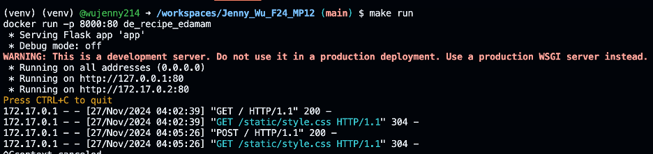
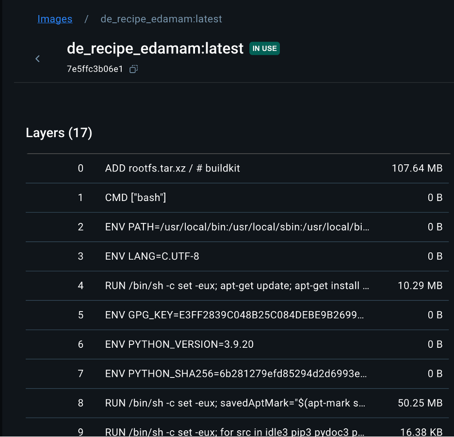
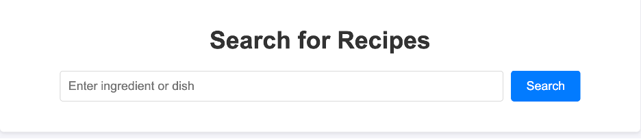
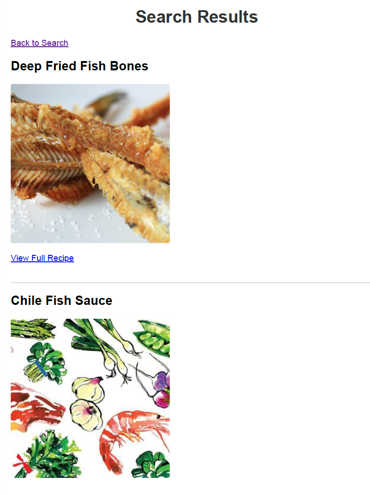
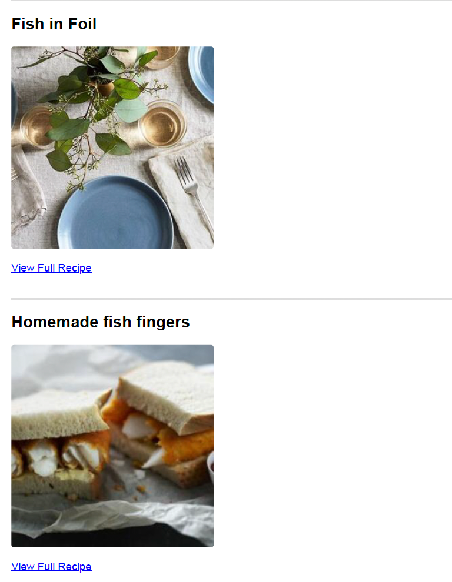

# Jenny_Wu_F24_MP12

Mini Project 12, Recipe Search with Edemam API for IDS706

Instructions: Create a simple Python application containerized with a dockerfile. The goal here is to both demonstrate running your application within a docker container (using docker run terminal commands) but to also build a docker image in your CI/CD pipeline which will be pushed to Docker Hub or other container management service.

## ☑️ Steps
1. Prepare the necesary configuration files like the Dockerfile, .devcontainer folder with Dockerfile & json (for running your code on Codespaces), Makefile, requirements.txt, and cicd.yml for GitHub Actions integration. Ensure that the requirements.txt lists all necessary packages (for example, flask).
2. Create an app.py file where you add your Flask app code.
3. Optionally, create a templates folder with a HTML file for the frontend of the app, and a static folder with a style.css file for styling the frontend.
4. Create a Dockerfile to containerize the Flask app and run it on container port 8000:80.
5. Set up your Makefile to build a container from the Docker image, log in to dockerhub (using your username and password), push the image to dockerhub using your credentials, and run the container (either locally or on Codespaces).
7. When you run the container, you will get a localhost URL which you can use to open and use your app on your browser. The following is an example of the expected output. 

## Webpage 
When opening the webpage, you will be presented a search bar to input specific ingredients you may be interested in cooking with. 

The following is an example of the first two pages of results for recipes that include fish as an ingredient. 

